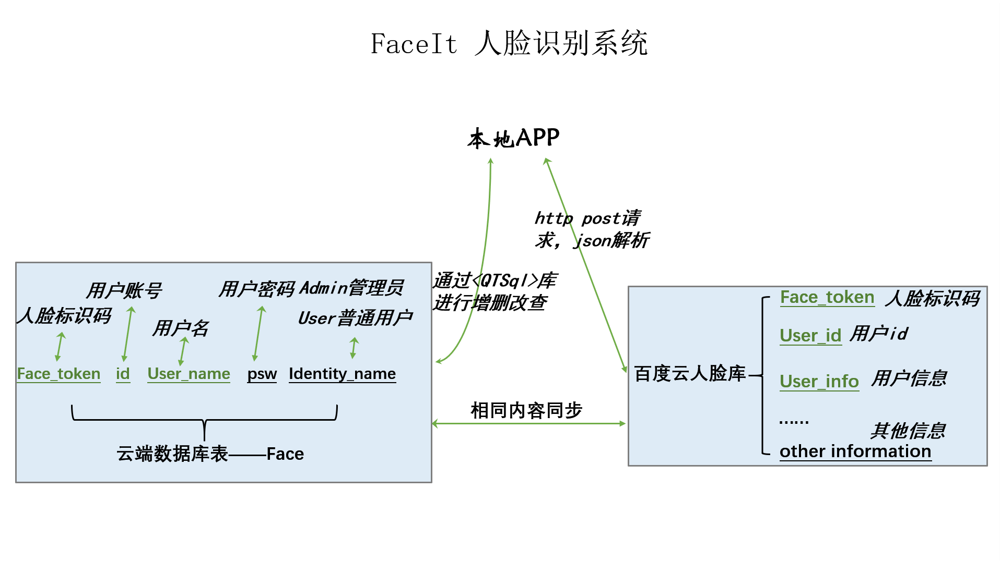
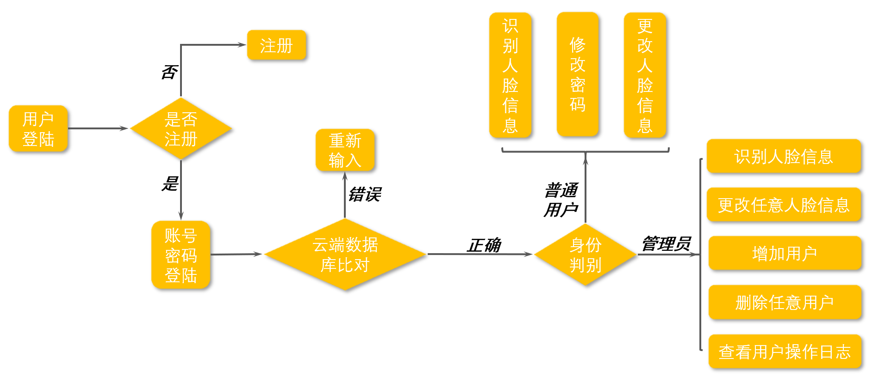
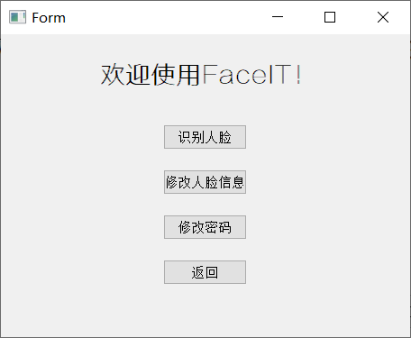

# FaceIt人脸识别系统

## 1.需求描述

​	要求实现一个简单的人脸识别系统。

​	***功能性需求***：

​	1.能够调用设备的摄像头，拍照，将照片数据传送到服务端。

​	2.服务端能够将所得数据与现有人脸库数据进行对比，返回结果。若人脸库已有相关信息，返回用户信息（名字），若没有则显示失败或非法用户。

​	3.用户能够完成一些基本的操作，如注册人脸、更新人脸、删除人脸等。

​	***非功能性需求***：

​	1.将用户分为两类，Admin管理员用户、user普通用户，不同用户权限不同，Admin比普通用户拥有更高权限。

​	2.基础的可视化界面，便于用户进行操作。

​	3.对用户的一些操作能够进行相应记录。

​	4.为普通用户提供修改密码的接口。

​	5.为Admin管理员用户提供可视化管理界面（如用户修改日志）。

## 2.技术选型

​		由于上学期刚刚学过*《面向对象程序设计》*一课，且相较于其他语言对$C++$了解更多，故语言上选取$C++$。为了满足非功能性需求中**基本可视化界面**的要求，本小组相应地选择了$Qt$作为开发框架。

​		同样的，为了满足云端存储数据与不同身份用户登陆的需求，我们在云端服务器上部署了MySQL，软件能够通过\<QtSQl\>库对云端数据库进行增、删、改、查操作。

​		由于课时与时间有限，我们人脸识别的算法实现是调用百度AI人脸识别的接口，并利用百度的人脸库进行人脸的储存。（百度云端人脸库与我们云端服务器的MySQL数据库所存储的数据有重叠部分，详情在下一节系统设计会描述）

图2.1FaceIt人脸识别系统技术选型

## 3.系统设计

​		虽然百度人脸库已经能够满足我们的大部分需求，但是它不能满足用户账号密码登陆的需求，于是我们在云端服务器上自己建立了一个MySQL数据库，除了记录与百度云人脸库用户相同信息（用户id、人脸标识码、用户信息，在图3.1中以绿色标识出来），还记录了用户密码、用户身份等用以满足非功能性需求的信息。

​		系统总体设计如下图所示：本地APP充当云端数据库和百度云人脸库的桥梁，通过设备摄像头对人脸照片进行捕获，将照片信息以post请求的形式传送给百度云人脸库，百度云人脸库根据上传信息进行相关操作、返回相应结果，本地APP根据返回结果在界面进行相应显示，并对云端数据库进行相关操作（如有必要）。

图3.1系统整体设计

​			系统总体逻辑和操作流程如下：

图3.2系统整体逻辑和操作流程

​		对于本系统较为重要的部分就是对数据库的操作以及百度云端人脸库的交互。

​		数据库部分，我们使用\<QtSql\>，通过嵌入式SQL(Embedded SQL)，直接在$C++$中使用MySQL语句对云端数据库进行操作。对于百度云端人脸库，我们通过http post方式对json格式的数据进行传输，上传到人脸库后，人脸库会根据信息返回json格式的字符串，我们通过对字符串的解析就能够获得相应信息（用户的Face_token即人脸标识符、用户info即用户信息（我们将用户名字储存在此）等）。

## 4.主要运行界面实例

### 4.1 主界面（登陆界面）

​		界面包含欢迎语，账号、密码输入框，登陆、退出按钮，注册按钮。

### 4.2普通用户登陆成功后功能界面

​		界面包含人脸识别按钮、修改人脸信息按钮、修改密码按钮、返回按钮。

### 4.3管理员用户登陆成功后功能界面

​		界面包含人脸识别按钮、增加任意用户信息按钮、删除任意用户按钮、修改任意用户人脸信息按钮、显示日志、返回按钮。

### 4.4人脸识别界面

​		此界面左侧会显示摄像头的实时画面，在按下右侧识别按钮后，右侧小框内会显示具体上传照片，小框下方会显示识别结果。最后还有返回按钮用以退出。（便于演示，我们将云端活体检测值设为“NONE”，即不进行活体检测）

### 4.5修改密码界面

​		修改密码界面要求输入账号、原密码、新密码，在账号与原密码与云端MySQL数据库匹配中的账号密码匹配的情况下，会将新密码覆盖原密码。返回按钮用以返回功能界面。

### 4.6 修改用户人脸信息界面

通过输入用户账号(管理员)，选择本地照片，点击确认修改按钮，我们可以修改任意用户的人脸信息。

## 5.项目总结

​		本项目用$C++$为基础语言、Qt为框架，通过连接云端MySQL数据库与百度人脸库，实现了具有用户登陆与身份识别功能的简单人脸识别系统。学习了Qt creator的基本使用，了解了Qt中数据库、网络编程、json格式字符串的构成与解析等相关库的使用，构建了软件从需求获取到开发，再到软件发布的全过程，且与前驱课程目前正在学习课程相结合（《面向对象程序设计》、《数据库系统概念》、《计算机网络》等）。虽然也因为时间和课时限制，有一些非功能性需求并没有完全实现（如UI界面简陋、数据库日志可视化识别未成功实现等），但整体上这是一次良好的程序设计综合实训体验，提高了动手能力、解决问题能力、系统整体设计能力。